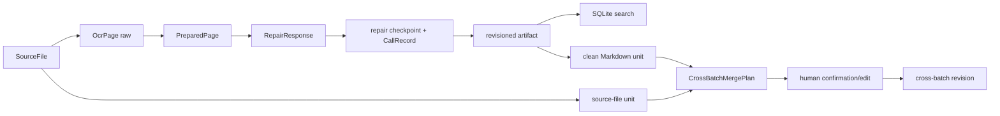

# 架构与作业提交说明

当前实现已经统一为“整页 repair + revision build”。不要再按旧 patch-first 文档实现或验收；旧名 `propose/apply` 仅作为 CLI/Web 兼容入口。

## 架构摘要

Workspace 管理多个 Vault。Vault 内按 `sources → raw → generated → runtime/.readtrace` 分层：导入可复制素材或保存外部引用；OCR 对 TXT/MD 直接读取、对图片/PDF 调用 Tesseract/Poppler；规范化只清理空白；Provider 每页返回完整 `repaired_text`；build 写入递增 revision 并保留 source anchor。CLI 启动时自动读取工程目录的 `.env`，因此 Tesseract/Poppler 路径和自定义 OpenAI-compatible Endpoint 可固定配置。



## 场景定制

1. **整页上下文修复**：角色对白、乱码说话人和断行需要跨句判断，模型返回整页而非逐条 patch；profile.md 可维护 `KEW/BRS/... → Banished` 等别名。
2. **分阶段 checkpoint**：OCR 与 LLM 修复拆开；每页成功立即落盘，失败页单独记录，批量任务可从中断处恢复。
3. **证据和版本**：默认 source snapshot，也支持 `--no-copy`；raw、规范化、repair 和 revision 都保留，可人工直接编辑/恢复。
4. **Provider 兼容**：HTTP 读取 OpenAI-compatible usage/价格，Codex CLI 使用本机登录，GLM/清华平台仅需配置。
5. **跨 batch 最小单元**：跨批次合并不把 batch 当成不可分割整体，而是选择单个导入文件或 `clean/`、`generated/*/*/current.md` 中的单个 Markdown 文件；计划保存每页顺序和来源锚点，确认前不会写最终 revision。
6. **引用门槛**：图片/PDF 的 raw OCR 与简单 normalization 只能审计，不能进入问答证据、最终 build 或跨 batch merge；必须先有完整 page repair。原始 TXT/Markdown 和 clean Markdown 因本身可读，可以直接引用。
7. **可控清理**：`delete-batch`/`delete-unit` 先输出 `DeletionPlan`，只有 `--confirm` 才删除素材和派生结果；runtime/events 审计记录保留，索引自动重建。

## 课程交付

- 设计 PDF：根据本文和 `docs/ARCHITECTURE_EXPLAINED.md` 绘制痛点、定制、架构、crate 四部分。
- Git 源码：README、`.env.example`、演示脚本和测试。
- AI 对话历史：从开发工具导出原始记录，放入网络学堂作业。
- Excel：按 `docs/DELIVERABLES_AND_COST_NOTES.md` 的阶段字段人工填入开发人时、API 次数、Token、USD/CNY、模型和工具。

## 运行时账本

repair/answer/ai-check 的每次调用写入 `runtime/calls.jsonl`；CLI `usage` 和 Web `/api/usage` 汇总 input/cached/output/total Token。调用次数始终计数，Token/费用未知保持 null；已知模型按每百万 Token 和缓存折扣计算，CNY 使用调用时汇率。该账本与开发阶段 Excel 分离。

## 验收

```powershell
$vault = "E:\AI_diary\summer_project\workspace\vaults\first_run"
cargo test --workspace
cargo run -p readtrace-cli -- process $vault E:\AI_diary\tests\1.png --ocr mock --llm mock
cargo run -p readtrace-cli -- usage $vault
cargo run -p readtrace-cli -- ocr-check
cargo run -p readtrace-cli -- ls E:\AI_diary\summer_project\workspace
cargo run -p readtrace-cli -- sources $vault
```

真实图片验证时把 OCR 切换为 `real`，Codex 验证用 `--provider codex-cli --preset codex-luna --thinking high`；没有 Tesseract 时，先用 Mock 确认其它阶段。CLI 默认输出人类摘要，需要完整机器 JSON 时加 `--format json`。

GUI 暂不实现；后续若启动 GUI，应复用现有 Web/CLI 协议，不在界面层复制业务逻辑。
