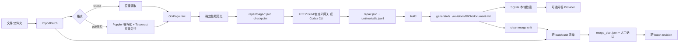

# ReadTrace 架构说明（当前实现）

## 1. 目标与边界

ReadTrace 面向“图片/PDF 中的文字质量差，但用户又希望保留原始证据”的场景。它不是通用文件管理器：当前只处理 TXT、Markdown、PDF 和常见图片；未知格式递归扫描时记录为 `skipped_files`。每个资料集合都是独立 Vault，Workspace 只负责发现和创建 Vault。

核心取舍：LLM 不再给出几十条逐字 patch，而是一次返回一页完整的 `repaired_text`。这样适合剧情、对话和长段落的上下文修复；人工审查通过原图、`raw/`、`normalization.json`、`repair/<page>.json` 和 revision 对照完成，而不被迫逐条点击。

## 2. 模块与数据流



- `readtrace-core`：领域结构、导入、OCR、规范化、repair/build、Provider、引用、索引和运行时台账。
- `readtrace-cli`：脚本友好的阶段命令；默认 `process` 只是四阶段编排器。
- `readtrace-server`：CLI 同一协议的轻量 Web/SSE 壳，前端不是另一套业务逻辑。
- `workspace.rs`：多 Vault 清单与路径安全。
- `text_cleanup.rs`：不猜词义的空白、行尾和标点邻接清洗。
- `prompt_templates.rs`：内置提示词及 Vault 级覆盖。
- OCR 程序路径由项目 `.env` 提供；`ocr-check` 会报告实际选中的 Tesseract、Poppler/pdfinfo、语言包、DPI 和并行度配置。PDF 先由 `pdfinfo` 取得页数，再按页用 Poppler 有界并行栅格化，最后以同一上限有界并行调用 Tesseract；事件因此可以显示 `0/N` 渲染和 `n/N` 页级识别进度。`READTRACE_OCR_DPI` 默认为 200，降低到 150 可换取速度但可能损失小字识别率。
- `MergeUnit` 把单个 source 文件或 clean Markdown 作为最小合并单位；它可以跨越多个 `ImportBatch`。

### 2.1 工作台界面

Web 端不是 CLI 的按钮皮肤，而是围绕 Vault 文件生命周期组织的工作台：

```text
Workspace / Vault 导航
        │
        ├─ 工作台：统计、最近文件、下一步入口
        ├─ 文件浏览：可折叠文件树 → 预览 → 勾选 source/clean → 跨 batch 合并或删除
        ├─ 导入队列：多个路径 + 复制策略 + 类型 + OCR/LLM/推理强度/合并偏好
        ├─ 处理批次：OCR → 规范化 → 整页修复 → revision
        ├─ 后台：最近命令、事件完成态、任务进度、Token 与费用
        ├─ 来源与 API：内置/自定义 Provider、密钥状态、价格和推理强度
        ├─ 检索：本地全文查询 + 可读上下文
        └─ 阅读与问答：会话侧栏 + 弹出式添加引用 + 只引用 clean
```

前端只保存当前选择、筛选器和待导入队列；所有会影响资料的操作都通过 Rust API 完成。文件选择器通过 `POST /api/import-upload` 接收 multipart 文件，服务端先在当前 Vault 的临时目录安全落盘，再委托同一个 core 文件夹导入器写入 `sources/`，处理完即清理临时目录；浏览器上传因此始终是“复制素材”，需要 `--no-copy` 外部引用时仍使用路径导入。文件浏览通过 `/api/files?view=essential|all` 获得清单，在浏览器端构建可折叠文件树，通过 `/api/file`（文本）或 `/api/file/raw`（图片/PDF）预览；Markdown/TXT 预览可直接编辑并经 `POST /api/file` 保存，raw、sources 和审计目录保持只读，保存后自动重建索引。外部引用源也会以虚拟文件显示，因此 `--no-copy` 不会让用户失去可见性。来源与 API 页面通过 `/api/providers` 读取内置和本机自定义 profile；`api_key` 只接受写入，响应只返回 `key_present`。默认的 `providers.json` 位于 Windows `%LOCALAPPDATA%/ReadTrace` 或 macOS `~/Library/Application Support/ReadTrace`，由 `READTRACE_PROVIDER_STORE` 覆盖；受限进程写不了用户目录时回退到当前 Vault 的 `.readtrace/providers.json`，这些位置都不会进入 Git。repair、answer 和 provider check 都使用同一个 `profile_id → ResolvedLlm` 解析路径，兼容旧客户端把 profile id 填进 `provider` 的请求，避免出现 `unknown LLM provider tsinghua-glm-5.2`。后台通过 `/api/activity` 合并持久化事件与当前任务：OCR/repair 的服务任务在成功、部分失败或失败时追加终态事件，任务卡片区分 `completed_with_errors` 与 `failed`；终端式事件区把历史启动/进度作为信息记录，实际运行状态以任务卡片为准。批次阶段同时写入 `raw/<batch>/batch.json` 和 `metadata.json`，所以刷新或重启后处理页仍能恢复“已完成/部分失败”等状态。后台同时显示 Token、USD/CNY 费用和未返回 usage 的调用数。删除仍遵循“先计划、后确认”，合并仍以 `MergeUnit` 为最小单位。

## 3. 关键结构

Vault 的持久化目录仍按职责分开：`sources/` 保存原素材快照，`raw/` 保存 batch/OCR，`generated/` 保存规范化、repair、revision；每次 build 或确认 merge 会将最终 Markdown 投影到 `clean/<name>/document.md`，这个目录是人工编辑、检索和引用的唯一内容边界。跨 batch 的计划和结果位于 `generated/merges/<merge_id>/`。`runtime/` 保存调用台账，`.readtrace/state.db` 是可重建的 SQLite 投影。

文件浏览会把 `clean/` 作为内容文件的一等目录展示；切换筛选或 Vault 时会自动展开其路径，当前 Vault 尚未生成 clean 时会显示可操作的提示。导入、处理、来源配置和阅读室统一使用 `None/Low/Mid/High` 推理强度。模型下拉框同时显示名称、`内置/自定义` 与 Key 状态，并在首次加载时优先选择已配置 Key 的自定义 GLM-5.2，避免同名内置来源误用未配置的环境变量 Key。

| 结构 | 作用 |
| --- | --- |
| `ImportBatch` | 批次、profile、顺序、source 列表、`copy_sources` 与状态 |
| `SourceFile` | 原始文件身份；`copied` 决定是否有 Vault 快照，`external_path` 支持 `--no-copy` |
| `OcrPage` | 原始 OCR 页；永不被模型覆盖 |
| `PreparedPage` | 规范化文本及逐条机械清洗记录 |
| `RepairResponse` | Provider 返回的完整页文本、notes、Usage、request id |
| `RepairedPage` | OCR/规范化/修复三份文本、Provider、模型、提示词 hash 和 call id |
| `RepairRun` | 批次级成功页与错误页汇总，可重跑 |
| `GeneratedArtifact` | 某次 build 生成的不可变 revision 路径及来源引用 |
| `MergeUnit` | 一个可独立选择的 source 文件或 clean Markdown 文件 |
| `CrossBatchMergePlan` | 跨 batch 的 unit/page 顺序、确认状态和 source 锚点 |
| `DeletionPlan` | batch/unit 删除范围、受影响 merge、确认状态和保留审计说明 |
| `SearchHit` | `clean/` 本地索引的命中行、来源锚点和前后两行可读上下文；不调用 LLM。写入 clean 时重建索引，查询阶段不再递归扫描文件 |
| `SourceExcerpt` | 进入问答 Provider 的最终证据；视觉 OCR 只接受完整 repair 文本 |
| `ConversationRequest.quotes` | 用户在引用弹窗中选定的可读 Markdown/TXT 内容；以文件名对应的 inline quote 进入当前轮，不伪装成 raw/source |
| `CallRecord` | 每次 LLM 调用的 provider、模型、thinking 挡位、Token、价格、费用、耗时和成功状态 |
| `ProviderProfile` | 可复用的来源配置；只在本机配置文件保存 API Key，Vault 和 API 响应均不含明文 |
| `Session` | 持久化问答消息、会话引用、Provider 快照和调用记录；阅读室侧栏按最近更新时间恢复 |

## 4. 可编辑点与恢复

提示词优先级为 `--prompt-file`、`vault/prompts/repair.md`、`.env` 的 `READTRACE_CORRECTION_PROMPT_FILE`、内置模板；`vault/prompts/profile.md` 会追加角色别名和专名背景。例如游戏对白可以把 OCR 产生的 `KEW/BRS/SW` 统一解释为 `Banished`，但不确定专名不强行猜测。

模型阶段按页写 checkpoint。已有 checkpoint 且其 `normalized_text` 未变化时跳过；`repair --refresh` 才重新调用。模型失败只写入 `RepairRun.errors` 和失败的 `CallRecord`，不会丢掉其它页。`build` 对图片/PDF 默认要求每页都有完整 repair；显式 `allow_unrepaired` 才会把规范化 OCR 作为带 warning 的应急稿，而且该稿不会进入引用证据。TXT/Markdown 因本身可读可以直接 build。任何旧 revision、原图和 raw OCR 都保留。人工可以直接编辑当前 Markdown，或复制任意 revision 恢复。

多来源 batch 会先生成 `MergePlan`；跨 batch 操作则生成 `CrossBatchMergePlan`。两者都允许人工编辑页序，确认后才构建；跨 batch 构建还会校验 unit/page 没有增删重复且 `source_ref` 未被篡改。跨 batch 的最小 unit 是单个 source 文件或 clean Markdown，而不是 batch。图片/PDF unit 在没有完整 repair checkpoint 时不能用于最终合并。

删除使用同样的人工确认边界：`delete-batch` 会预览并删除该 batch 的 raw/source/generated 和引用它的跨 batch 计划；`delete-unit` 只删除选中的 source/clean 单元，必要时让 batch 的 generated 结果失效。两者都保留 `runtime/calls.jsonl` 与 `events/events.jsonl`，完成后重建 SQLite 索引；没有 `--confirm` 不发生删除。

问答引用有单独的证据门槛：原始 TXT/Markdown 和 clean Markdown 可以直接作为最终文本；图片/PDF 只从完整 `RepairedPage.repaired_text` 生成 `SourceExcerpt`。raw OCR 和仅做空白规范化的视觉文本不会被送给问答 Provider。

## 5. Provider 适配

`LlmProvider::repair_page` 和 `answer` 是唯一上层接口。HTTP 实现使用 OpenAI-compatible Chat Completions，读取 `usage`、`id`、自定义认证头、`max_tokens` 字段和推理参数；因此清华网关、GLM、DeepSeek、Ollama 及其它兼容服务都只需改 `.env`。GLM-5.3/5.3-Flash 的网关规定必须思考，适配器发送 `thinking:{"type":"enabled"}` 与 `reasoning_effort=low|high|max`，把 `none`/`medium` 映射到最低 `low`；GLM-5.2 等模型则可发送 `thinking:{"type":"disabled"}` 真正关闭思考。HTTP 错误也保留不含密钥的响应预览，便于发现这类模型协议差异。Codex 实现调用本机 `codex exec --ephemeral --sandbox read-only --json`：最终文本来自 `--output-last-message`，Token 来自 `turn.completed.usage`，线程 ID 记录为 request id；模型名和 thinking 可通过 preset/参数设置，项目 Key 不会传入 Codex。可执行文件由 `READTRACE_CODEX_BIN` 控制，适配器会解析 Windows 的 `.exe`、`.cmd`、`.bat` 和 `.ps1` 入口，并在 PATH 不完整时尝试本地 Codex 安装目录；GUI 本身不等于 CLI。受限的 Codex 内置终端可能禁止 CLI 写入 `CODEX_HOME`，从而在网络请求前报 `os error 5`；这属于宿主权限/证书环境限制，不应由适配器绕过，也不应复制登录态文件。适配器会把只读数据库、拒绝访问和 CA 证书错误转换成可行动的提示，建议切换到普通 PowerShell/Windows Terminal。

OCR 也不依赖当前 shell 的 PATH：CLI 首先加载项目 `.env` 中的 `READTRACE_TESSERACT_BIN`、`READTRACE_PDFTOPPM_BIN`、可选的 `READTRACE_PDFINFO_BIN`、`READTRACE_OCR_DPI`、`READTRACE_OCR_CONCURRENCY` 和 `TESSDATA_PREFIX`；未配置时再查找项目内工具目录、Homebrew 常见路径、Windows 常见安装位置和 PATH。`ocr-check` 给出实际解析路径和可执行状态。

修复 prompt 强制 JSON `{"repaired_text":"..."}`，禁止分析、confidence、patch 和引用框。若 JSON 不合约，或输出疑似删掉段落/页面尾部，当前页标记失败并保留 OCR，不把模型解释文字写进正文。

## 6. 运行时 Token 与费用

每一次 repair 页调用、answer 调用和 `ai-check` 探针都会立即追加到 JSONL ledger（Vault 默认是 `runtime/calls.jsonl`，探针可用 `--ledger` 指定位置），即使 Provider 未返回 usage 也计入调用次数。`usage --scan-root` 会读取扫描根下所有 `.jsonl` 并按 `call_id` 去重，包含 `tmp` 中自定义文件名的测试账本。input/output Token 缺失保持 `null`，cached input 若 Provider 未返回也保持 `null`，费用保持 `null`；绝不把未知伪装为 0。已知价格时按：

```text
cached = min(cached_input_tokens, input_tokens)
uncached = input_tokens - cached
USD = uncached / 1,000,000 × input_price
    + cached / 1,000,000 × cached_input_price
    + output_tokens / 1,000,000 × output_price
CNY = USD × READTRACE_USD_TO_CNY（默认 6.8）。历史调用保留各自记录时的汇率，不会因修改 `.env` 被回写。
```

CLI `usage` 或 Web `/api/usage` 汇总调用数、input/cached-input/output/total Token、USD/CNY、未知费用次数和失败次数。历史 Codex 记录只要已经保存 input/output，就会在读取账本时按 model 回填官方单价并持久化；确实没有 usage 的失败调用仍为 `null`，不会从文本长度猜 Token。Mock 调用显式记为非计费的 `$0`。课程要求的“开发阶段 AI 开销 Excel”仍应把 Codex/ChatGPT 等外部开发对话按阶段人工登记；它与本项目运行时账本分开，避免把订阅或人工开发成本冒充 API 账单。

### 6.1 计费公式和模型价格

每条 `CallRecord` 会保存调用当时的三档单价快照，历史价格不会因以后修改 `.env` 而改变。`cached_input_tokens` 是 `input_tokens` 的子集，计算时先截断到不超过 input：

```text
cached = min(cached_input_tokens, input_tokens)
uncached = input_tokens - cached
USD = uncached / 1,000,000 × input_price
    + cached / 1,000,000 × cached_input_price
    + output_tokens / 1,000,000 × output_price
CNY = USD × usd_to_cny
```

当前内置的模型价格（USD/百万 Token）来自已记录的官方价格表；Codex preset、OpenAI-compatible HTTP、GLM‑5.2 和 GLM‑5.3 Flash 都会按模型自动套用，未知自定义模型继续使用 `.env` 中的三项 `READTRACE_*_PRICE`：

| 模型 | input | cached input | output |
| --- | ---: | ---: | ---: |
| GPT-5.6 Luna | 0.20 | 0.02 | 1.20 |
| GPT-5.6 Terra | 2.00 | 0.20 | 12.00 |
| GPT-5.6 Sol | 4.00 | 0.40 | 20.00 |
| GPT-5.5 | 5.00 | 0.50 | 30.00 |
| GPT-5.4 | 2.50 | 0.25 | 15.00 |
| GPT-5.4 Mini | 0.75 | 0.075 | 4.50 |
| GPT-5.4 Nano | 0.20 | 0.02 | 1.25 |
| GPT-5 Mini | 0.25 | 0.025 | 2.00 |
| GPT-5 | 1.25 | 0.125 | 10.00 |
| GPT-4o Mini | 0.15 | 0.075 | 0.60 |
| GLM 5.3 Flash | 0.15 | 0.03 | 0.50 |
| GLM 5.2 | 1.40 | 0.26 | 4.40 |

价格依据：[GPT-5.6 Luna](https://developers.openai.com/api/docs/models/gpt-5.6-luna)、[GPT-5.6 Terra](https://developers.openai.com/api/docs/models/gpt-5.6-terra)、[GPT-5.6 Sol](https://developers.openai.com/api/docs/models/gpt-5.6-sol)、[GPT-5.4](https://developers.openai.com/api/docs/models/gpt-5.4)、[GPT-5.5](https://developers.openai.com/api/docs/models/gpt-5.5) 和 [Z.ai 官方价格页](https://docs.z.ai/guides/overview/pricing)。页面或模型版本变化时，应更新 `official_model_pricing` 的版本号，并保留旧账本中的快照。

## 7. 当前完成度与待办

截至 2026-09-02，核心后端和工作台 GUI 已达到可演示状态：core 68 项、server 9 项测试通过（Workspace 共 77 项），真实 Tesseract 路径可由 `.env` 解析，PDF 页级进度与有界并行 OCR、整页 repair、引用问答、session、同 batch 合并、跨 batch unit 合并、确认式删除、任务查询/取消、Workspace/Vault 创建与切换、文件浏览/预览、Markdown 编辑保存、Provider profile 管理和 revision 查看均已落地。生成结果会自动投影到 `clean/<name>/document.md`，检索与引用只读 clean。CLI 现在默认输出结构化人类摘要，脚本可用 `--format json` 取得完整 JSON。

本轮审计已执行 `cargo fmt --all -- --check`、`cargo test --workspace`、`cargo clippy --workspace --all-targets -- -D warnings`；三项均通过，Workspace 共 77 项测试通过（core 68、server 9）。新增覆盖 GLM‑5.2 官方价格和宿主无关的 Windows 盘符/UNC 上传路径拒绝。另用现有 25 页 PDF 完成真实 OCR，当前实现耗时约 29.6 秒（旧的整批栅格化实现约 58.7 秒）；事件记录了 `0/25` 栅格化、逐页 `n/25` 和最终 `25/25`，默认并行度为 4。Chrome 验证了独立检索页、可读上下文、clean 文件树多选与即时文件名筛选、Mock 连续会话、推理强度、Markdown 编辑保存和旧 profile id 兼容，控制台无错误。GLM-5.3-Flash 真实探针验证 `none→reasoning_effort=low`，GLM-5.2 真实探针验证 `thinking.type=disabled`，两者均返回标准 usage。视觉来源未修复时的引用、严格 build、旧 apply 和跨 batch merge 均有拒绝测试；`allow_unrepaired` 应急路径明确留下 warning，修复任务会区分部分成功与全失败，并拒绝疑似删段的整页输出。

### P0：课程交付前必须完成

| 事项 | 当前状态 | 完成条件 |
| --- | --- | --- |
| 课程设计文档 PDF | 待办 | 把痛点、至少两项场景定制、架构图、数据流、关键结构和 crate 选型整理成 PDF，并完成渲染检查。 |
| AI 对话历史与开发开销 Excel | 待办 | 导出完整原始对话；按课程阶段填写人时、调用数、Token、费用、模型和工具。运行时 ledger 不能替代开发账单。 |
| 最终验收矩阵 | 部分完成 | 已覆盖 TXT/Markdown、图片、文件夹、多来源确认、跨 batch merge、`--no-copy`、断点续跑、失败页和引用门槛；仍应补一份 PDF/HTTP/GLM 实机记录和可复现验收日志。 |
| 运行时费用闭环 | 已完成 | `runtime/calls.jsonl`、Codex/HTTP usage 和 `usage --scan-root` 去重已工作；历史已知 model/token 记录会回填，Mock 为 `$0`，只有无 usage 的失败或未知价格才保持 `null`。 |

### P1：影响日常使用

| 事项 | 当前状态 | 下一步 |
| --- | --- | --- |
| Web/GUI | 工作台已可用 | 已加入来源与 API 页面、统一 Provider 选择、可见引用托盘和大对话区；后续可补跨 batch merge 可视化排序、统一 HTTP 错误码、预算停止条件和桌面打包。 |
| 批量资源控制 | 已完成有界并行 | repair 默认最多并行 4 页，OCR 也默认最多并行 4 页，可在 `.env` 分别用 `READTRACE_LLM_CONCURRENCY=1..64`、`READTRACE_OCR_CONCURRENCY=1..16` 调整；checkpoint 和结果顺序保持稳定。退避重试、预算停止条件仍是后续增强。 |
| OCR 可移植性 | 当前机器已配置 | 交付包应附 Tesseract/Poppler 安装说明或固定工具目录；`ocr-check` 已报告 Tesseract、pdftoppm、pdfinfo 和并行度，可用于启动前检查。 |
| OCR 重跑与外部文件变更 | 部分完成 | `--no-copy` 指向的文件若被替换，建议重新导入生成新 batch；后续可为 OCR run 增加版本号和 stale-page 清理。 |
| 人工审查效率 | 文件级可用 | 增加 `diff`、`restore` 和 merge plan 校验提示，减少手工查目录。 |
| 搜索与引用 | 已完成 | 搜索保持本地且只索引 `clean/`；显式引用只使用用户选定的 clean 文件，视觉 OCR 必须先有完整 repair；引用弹窗下方是可折叠 clean 文件树，支持本地文件名筛选和多选。 |

### P2：暂不影响本次核心验收

| 事项 | 当前状态 | 说明 |
| --- | --- | --- |
| GUI/桌面打包 | Web 工作台已完成，桌面打包未开始 | 继续复用 CLI/Web 协议，不另写业务逻辑。 |
| 更多格式 | 明确跳过 | 继续只处理 TXT、Markdown、PDF 和常见图片；EPUB/DOCX 等等待明确需求。 |
| LLM 自动合并 | 未启用 | 当前合并是可编辑、可确认的确定性顺序，避免模型擅自重排或总结。 |

当前收尾顺序是：完成课程 PDF、AI 历史和 Excel；补齐学校 HTTP/GLM 的真实 Provider 验收日志；继续打磨跨 batch merge 编辑和桌面打包。Codex CLI 若出现 Windows“拒绝访问”，应先按 `docs/IMPLEMENTATION_AUDIT.md` 的环境检查处理，不应把失败调用的 null usage 当作计费数据。

## 8. crate 选择

| 模块 | crate | 原因 |
| --- | --- | --- |
| CLI | `clap` | 子命令、枚举值和帮助稳定可脚本化 |
| 异步/OCR/Provider | `tokio`, `async-trait` | 子进程、超时、取消和统一 trait |
| HTTP | `reqwest` | TLS、JSON、超时和 OpenAI-compatible 请求 |
| 数据 | `serde`, `serde_json`, `chrono`, `uuid` | 人可读持久化、时间和稳定 ID |
| 本地搜索 | `rusqlite` | 无外部服务，索引可重建 |
| Web | `axum`, `async-stream` | 薄 API 层和 SSE 进度 |

## 9. 与课程验收的对应

- 痛点：OCR 错字、断行和角色标签需要上下文；逐条 patch 无法覆盖整页语境。
- 场景定制：整页返回 + profile prompt；OCR/repair 分阶段 checkpoint；原素材 snapshot/外部引用和 revision 历史；OpenAI-compatible/ Codex 双 Provider。
- 架构图、数据流、结构和 crate 见本文；`ls`/`sources`、同 batch 与跨 batch 合并、引用问答、删除和 OCR 环境命令见 [`CLI_TUTORIAL.md`](CLI_TUTORIAL.md)；逐步示例见 [`CLI_END_TO_END_EXAMPLE.md`](CLI_END_TO_END_EXAMPLE.md)；Web/GUI 端点见 [`WEB_GUI_PROTOCOL.md`](WEB_GUI_PROTOCOL.md)；交付与成本规则见 [`DELIVERABLES_AND_COST_NOTES.md`](DELIVERABLES_AND_COST_NOTES.md)；逐项验收见 [`IMPLEMENTATION_AUDIT.md`](IMPLEMENTATION_AUDIT.md)。CLI 默认输出人类摘要，需要原始 JSON 时加 `--format json`。
